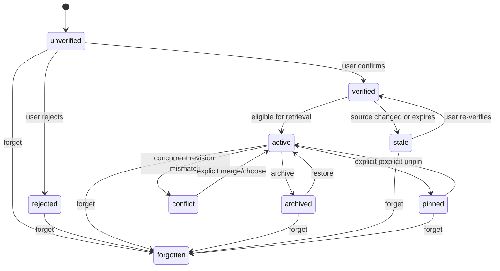

# DSH Workspace v0.5 Memory Governance

Decision record for issue #35. It governs the v0.4 `MemoryRecord` domain from
[`dsh-v04-project-memory-decision.md`](./dsh-v04-project-memory-decision.md)
and does not grant any record automatic entry into model context.

## Governance principles

1. Every record is provenance-visible before it can be used.
2. A user action is required to activate, edit, pin, share, import, or forget a
   record. Model suggestions are proposals, never authority.
3. Scope is an authorization boundary, not a ranking hint. A Project record
   cannot be read or written through a User, Session, or Shared Project key.
4. Conflicts are preserved and shown; the store never silently chooses the
   last writer.
5. Forget removes the record from future retrieval and context eligibility,
   while clearly disclosing that already-exported copies or prior model turns
   cannot be recalled.

## Provenance and verification

The v0.4 provenance object is extended with governance fields:

```ts
type MemoryGovernance = {
  origin: "user-authored" | "imported" | "derived" | "model-suggested";
  sourceRefs: readonly {
    kind: "session" | "event" | "file" | "url" | "import";
    id: string;
    contentHash?: `sha256:${string}`;
  }[];
  verification: "unverified" | "verified" | "rejected" | "stale";
  verifiedAt?: number;
  verifiedBy?: "user" | "trusted-tool";
  confidence?: "low" | "medium" | "high";
  revision: number;
  conflictGroup?: string;
  pinnedAt?: number;
  pinnedBy?: "user";
  expiresAt?: number;
  retention: "session-end" | "project-delete" | "user-managed";
};
```

Rules:

- User-authored records may start `verified` only after the explicit save
  action; imported, derived, and model-suggested records start `unverified`.
- A source reference is required for imported/derived/model-suggested records.
  File references include the source hash; event references include the
  Harness session/event identity. A missing or changed source moves the record
  to `stale` and removes context eligibility.
- `rejected` proposals remain auditable until the user forgets them. Rejection
  is not an invisible delete.
- Confidence is explanatory metadata, not an authorization decision. The UI
  shows origin, source, verification, revision, hash prefix, and last-used
  data in the record detail and before any governed context action.

## State transitions



`forgotten` is a tombstone and is excluded from search/context. Physical
content scrubbing occurs during explicit/threshold compaction after the
retention and undo window. A forgotten record may be restored only from an
explicit user export/backup; there is no hidden recycle bin.

## Authorization matrix

All mutations go through typed Host operations that re-check the current
scope key and authenticated local owner:

| Action | Session | Project | User | Shared Project |
| --- | --- | --- | --- | --- |
| View/search | current session + root | canonical root | current local profile | explicit opt-in + canonical root |
| Create/edit/verify | current session owner | project owner | profile owner | explicit shared-write permission |
| Pin/unpin | current session owner | project/profile owner | profile owner | explicit shared-write permission |
| Archive/restore | same as edit | same as edit | same as edit | same as edit |
| Forget | explicit confirmation | explicit confirmation | explicit confirmation | explicit confirmation and shared-write permission |
| Import/export | current session only | project owner | profile owner | explicit opt-in; imported records start unverified |

The Web client cannot elevate scope, submit a raw path, or mark a model
proposal verified. A missing, moved, or mismatched Workspace root returns the
v0.4 unavailable state and leaves records unchanged.

## Pinning and model-context boundary

Pinning means “eligible for a later governed context action”; it does not
inject content. A future context request must present a review containing the
record IDs, scopes, provenance, hashes, token/byte estimates, and the exact
message payload. The user explicitly confirms that action, and the Host writes
an audit entry before invoking the public Agent continuation/context seam.

Until that separate governed action exists, `pinnedAt` is UI state only and no
memory record is sent to an Agent, followup, prompt, or model provider.

## Edit, duplicate, and conflict semantics

- Edit uses optimistic concurrency: the request includes `id`, `revision`, and
  `contentHash`. A mismatch returns `CONFLICT` with both current and proposed
  metadata; it never overwrites the current record.
- A successful edit appends a complete next revision and retains the previous
  revision reference for audit/undo. The new content must be re-verified when
  the source or provenance changes.
- An exact `(scope, type, contentHash)` duplicate is idempotent and merges
  provenance references without increasing the visible record count.
- Same-scope records with different content but the same normalized title are
  retained in one `conflictGroup`; the UI presents a side-by-side diff and
  requires an explicit choose/merge action. Merging creates a new revision
  that lists both parents.
- Concurrent JSONL writers use the v0.4 store lock/atomic append contract. A
  lock timeout or partial append is a typed save failure, not an implicit retry
  or last-write-wins resolution.
- A source hash change, expiry, or root mismatch marks derived records stale;
  stale records remain visible for repair but cannot be pinned or injected.

## Retention, deletion, import, and recovery

- Session records default to `session-end`; Project and Shared Project records
  default to `project-delete`; User records are `user-managed`. Expiry creates a
  visible stale/expired state before tombstoning and never silently feeds a
  model.
- Forget requires a confirmation that names the scope and record count. It
  appends tombstones, removes records from search immediately, and scrubs
  content on the next successful compaction. Failed writes preserve the old
  record and show a retryable unsaved state.
- Export is an explicit, local JSONL/JSON bundle containing schema version,
  content hashes, provenance, revisions, and scope. Import is read-only
  quarantine first: IDs are remapped, source hashes are rechecked when
  available, and every imported record starts `unverified` until reviewed.
- Migration preserves revision/tombstone history and uses the v0.4 temporary
  file + fsync + atomic rename strategy. Unknown future versions remain
  read-only and cannot be deleted by an older client except through an explicit
  whole-file user action.
- Deleting a project removes Project/Shared Project files only after an
  explicit confirmation and successful backup/compaction. User/Session files
  are not silently removed. A prior export or model turn outside the store is
  disclosed as unretractable.

## Accessibility and failure UX

- Edit, pin, unpin, archive, restore, import, and forget controls are keyboard
  reachable, have visible focus, announce scope/status, and return focus to
  the invoking control after dialogs close.
- Forget and shared-scope writes use a confirmation dialog with the exact
  count, scope, and recovery limitation. Conflict views expose headings for
  current/proposed/source and offer keyboard-selectable merge/choose actions.
- Corruption, stale sources, unavailable roots, save conflicts, lock timeouts,
  and failed compaction render local error states with retry/export guidance;
  they never disable Files/Session/Changes or leak absolute paths/content.

## Acceptance-test outline

1. Provenance fixtures cover user, import, derived, and model-suggested
   records; only explicit verification permits active/pinned eligibility.
2. Scope authorization tests reject cross-session/root/profile/shared writes
   and raw-path or model-proposal elevation.
3. State-machine tests cover verify/reject/stale/reverify, pin/unpin,
   archive/restore, conflict, tombstone, expiry, and restore-from-export.
4. Optimistic concurrency tests preserve both revisions, deduplicate exact
   hashes, and require explicit merge/choose for title conflicts.
5. Forget/export/import/migration tests prove immediate retrieval exclusion,
   compaction scrubbing, remapped IDs, unverified imports, and disclosure of
   unretractable prior copies.
6. Web accessibility tests cover focus return, keyboard dialogs, scope/status
   announcements, and local recovery on failed writes.
7. A no-injection test proves that search, pin, and record rendering do not
   call Agent, followup, prompt, or model APIs; only a separately confirmed
   context action may do so.

## Rejected alternatives and upgrade trigger

- Last-write-wins edits are rejected because they destroy provenance and make
  shared/project conflicts invisible.
- Automatic model verification, automatic pinning, and background prompt
  injection are rejected because they violate human control and the v0.4
  storage/context separation.
- Hard deletion without a tombstone/audit trail is rejected because it cannot
  explain shared-scope changes or recover from an accidental destructive click.
- Network sync and remote shared memory are out of scope until a future
  authenticated carrier and explicit privacy model exist.

Re-run this decision when the v0.4 schema, Host authorization, or public Agent
context carrier changes.
